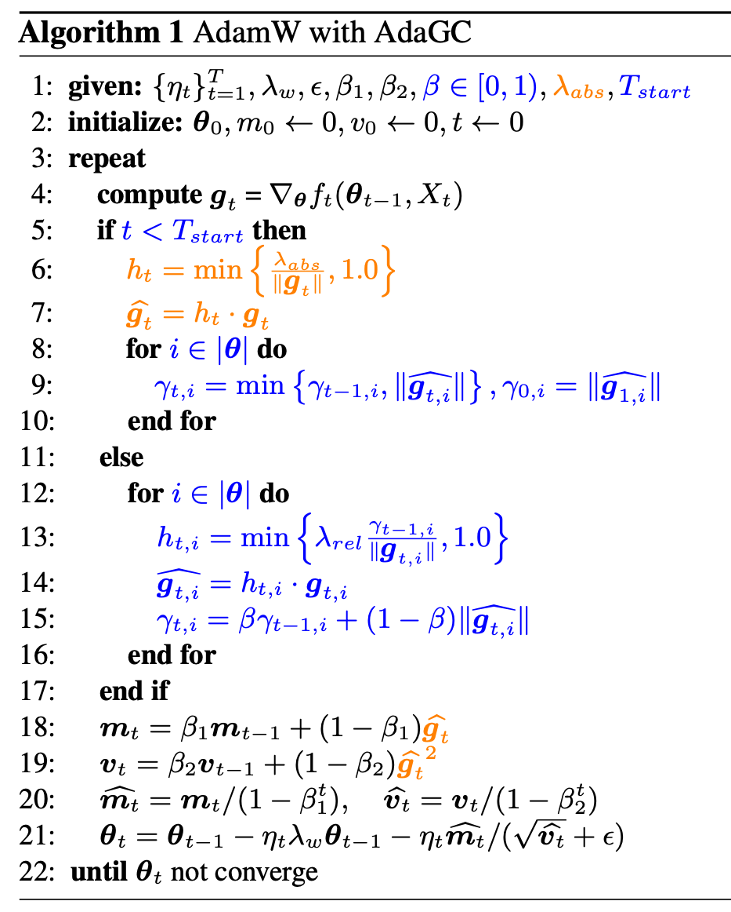

<div align="center">

# AdaGC

### Enhancing LLM Pretraining Stability via Adaptive Gradient Clipping

[](https://arxiv.org/abs/2502.11034)
[](../../LICENSE)
[](https://www.python.org/)
[](https://www.paddlepaddle.org.cn/)

</div>

---

## Overview

Loss spikes are a common obstacle in large-scale LLM pretraining. Although they may be triggered by diverse factors such as data outliers, numerical precision issues, hardware faults, or optimizer hyperparameters, they often share a common consequence: abnormal gradients contaminate optimizer states and lead to unstable updates.

**AdaGC** is an optimizer-agnostic tensor-wise adaptive gradient clipping method. It tracks the historical gradient norm of each parameter tensor with an exponential moving average (EMA), and clips only those gradients that significantly deviate from their own historical scale. By suppressing abnormal gradients before they enter optimizer states, AdaGC improves pretraining stability while preserving normal learning dynamics.

AdaGC introduces negligible memory overhead, reduces communication compared with GlobalGC in hybrid-parallel training, and has been validated on dense and MoE LLMs including Llama-2, Qwen3, Mixtral, and ERNIE.

> *Paddle implementation is available at https://github.com/PaddlePaddle/Paddle/pull/79041*

## 🔔 News

- **[2026.06.03]** PyTorch implementation of AdaGC, along with example scripts for GPT-2/Llama-2/Qwen3/Mixtral pretraining is now available at this repository.
- **[2026.05.01]** 🎉 Our paper has been accepted by **ICML 2026**!


## 📌 TODO

- [ ] Release PaddlePaddle evaluation code
- [x] Release PyTorch evaluation code

## Method

<p align="center">
  
</p>

AdaGC stabilizes LLM pretraining through tensor-wise adaptive gradient clipping. Instead of applying a single global threshold to all gradients, AdaGC maintains an EMA of each tensor's historical gradient norm and uses it as a local adaptive reference for clipping.

For the $i$-th tensor, AdaGC performs:

$$
g_{t,i} \leftarrow h_{t,i} g_{t,i}, \quad
h_{t,i} = \min\left\{1.0, \frac{\lambda_{\text{rel}}\gamma_{t-1,i}}{\|g_{t,i}\|}\right\},
$$

where the EMA state is updated as:

$$
\gamma_{t,i} = \beta \gamma_{t-1,i} + (1-\beta)\|g_{t,i}\|.
$$

| Stage | Name | Description |
|---|---|---|
| 1 | Warm-up with GlobalGC | During the initial unstable training stage, AdaGC applies GlobalGC and initializes tensor-wise EMA states. |
| 2 | Tensor-wise Norm Tracking | For each parameter tensor, AdaGC tracks an EMA of historical clipped gradient norms as its adaptive reference scale. |
| 3 | Adaptive Gradient Clipping | Each tensor is clipped independently when its current gradient norm exceeds its own EMA-based threshold, preventing abnormal gradients from entering optimizer states. |

Compared with GlobalGC, AdaGC provides temporal adaptivity, tensor-wise locality, and lower communication overhead in hybrid-parallel distributed training.

---
## Quick Start

### Environment Setup

For complete installation instructions, please refer to the official documentation of each framework.

### Clone the Repositories
Clone the specific versions of the `Megatron-LM` and `Megatron-LLaMA` repositories:

```bash
# GPT-2 345M model pretraining
git clone https://github.com/NVIDIA/Megatron-LM
mv Megatron-LM Megatron-LM-GPT
cd Megatron-LM-GPT
git checkout feac76a79148622d8f2a45d46c08a972a24784a3
# check whether the patch is available
git apply --check path/to/megatron-gpt2.patch
# apply our provided patch
git apply path/to/megatron-gpt2.patch


# Llama-2 tiny/1.3B/7B/13B/70B model pretraining
# clone the Megatron-LLaMA repository
git clone https://github.com/alibaba/Megatron-LLaMA
cd Megatron-LLaMA
git checkout 25306de84d300b47a3973cd798463ae7d09019bd
# check whether the patch is available
git apply --check path/to/megatron-llama.patch
# apply our provided patch
git apply path/to/megatron-llama.patch


# Mixtral 8x1B model pretraining
# clone the Megatron-LM repository
git clone https://github.com/NVIDIA/Megatron-LM
mv Megatron-LM Megatron-LM-Mixtral
cd Megatron-LM-Mixtral
git checkout 378259df0e12327992b1393f86cf7427526503bf
# check whether the patch is available
git apply --check path/to/megatron-mixtral.patch
# apply our provided patch
git apply path/to/megatron-mixtral.patch
```

### Download C4-en Dataset

Download and convert the dataset format using Hugging Face Datasets:

```python
from datasets import load_dataset
c4 = load_dataset("c4", "en")
c4["train"].to_json("c4_en_train.jsonl")
c4["validation"].to_json("c4_en_valid.jsonl")
```

### Data Preprocessing

#### Preprocessing for GPT-2 Format
Run the following script to preprocess c4_en_train.jsonl for Megatron-LM in GPT-2 345M experiments:
```bash
cd Megatron-LM-GPT
python tools/preprocess_data.py \
    --input path/to/c4_en_train.jsonl \
    --output-prefix data/meg-c4-en-train \
    --vocab-file data/gpt2-vocab.json \
    --tokenizer-type GPT2BPETokenizer \
    --merge-file data/gpt2-merges.txt \
    --append-eod \
    --workers 12
```

#### Preprocessing for Llama-2 Format
Data preprocessing for LLaMA models (applicable to both Tiny, 7B, 13B, and 70B models):
```bash
cd Megatron-LLaMA
python tools/preprocess_data.py \
    --input path/to/c4_en_train.jsonl \
    --output-prefix data/llama-7b/meg-llama-7b-c4-en-train \
    --tokenizer-type PretrainedFromHF \
    --tokenizer-name-or-path data/llama-7b \
    --chunk-size 1000 \
    --append-eod \
    --workers 12
```

### Model Training

Run the corresponding training script:

#### GPT-2 345M model
```bash
cd Megatron-LM-GPT
# modify the dataset path in the script before running
# DATA_PATH=path/to/meg-c4-en-train_text_document
bash run_pretrain_gpt2_345m.sh
```

#### Llama-2 series model
```bash
# Llama-2 tiny
cd Megatron-LLaMA
bash examples/LLaMA/LLaMA_tiny_standalone.sh

# Llama-2 1.3B
bash examples/LLaMA/LLaMA_1.3B_standalone.sh

# Llama-2 7B
bash examples/LLaMA/LLaMA_7B_standalone.sh

# Llama-2 13B
bash examples/LLaMA/LLaMA_13_standalone.sh

# Llama-2 70B
bash examples/LLaMA/LLaMA_70B_dp8_tp8_pp8.sh
```

#### Qwen3 1.7B model
```bash
cd Megatron-LLaMA
bash examples/Qwen/Qwen3_1p7B.sh
```

#### Mixtral 8x1B
```bash
cd Megatron-LM-Mixtral
bash examples/mixtral/train_mixtral_8x1b_distributed.sh
```

---

## Citation

If you find this work useful, please cite our paper:

```bibtex
@article{wang2025adagc,
  title={Adagc: Improving training stability for large language model pretraining},
  author={Wang, Guoxia and Li, Shuai and Chen, Congliang and Zeng, Jinle and Yang, Jiabin and Yu, Dianhai and Ma, Yanjun and Shen, Li},
  journal={arXiv preprint arXiv:2502.11034},
  year={2025}
}
```
